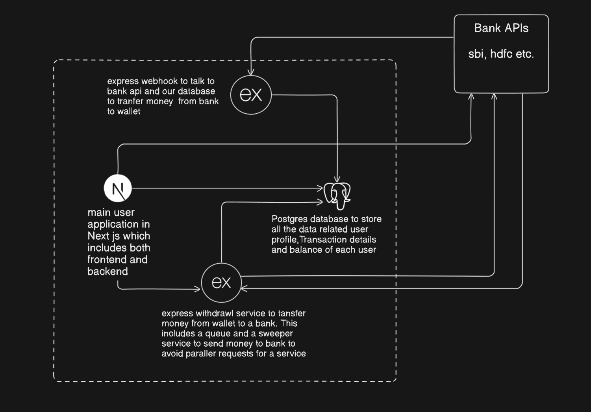
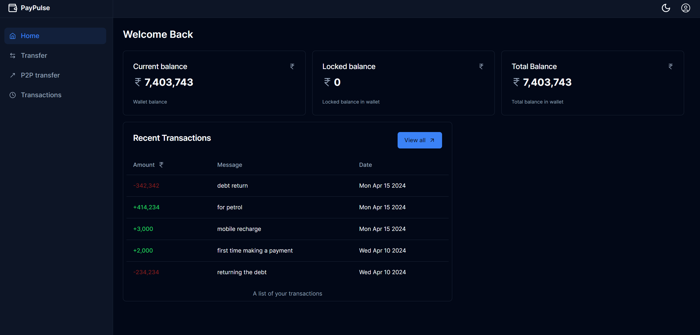
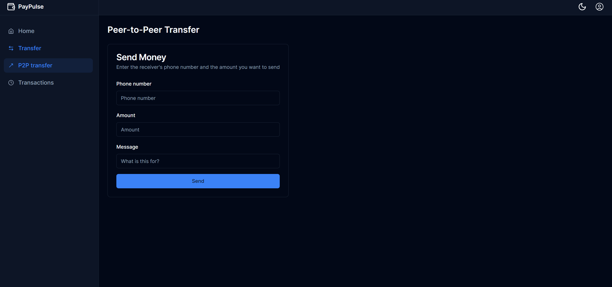
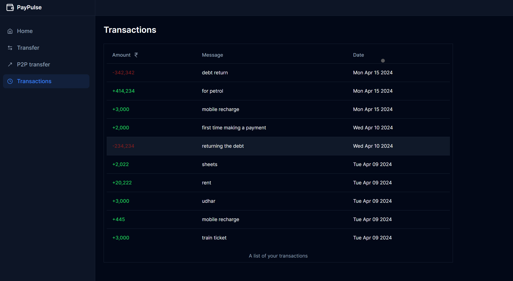
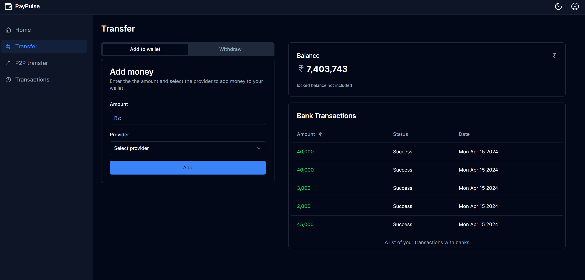

# PayPulse

### A digital wallet for Peer-to-Peer money transfers

## Tech stack used for building this project:

- [Typescript](https://www.typescriptlang.org/) & Javascript - Language
- [Node.Js](https://nodejs.org/en) - Runtime environment for Js
- [Express](https://expressjs.com/) & [ejs](https://ejs.co/) - sudo bank app
- [Next.js](https://nextjs.org/) - Framework for application
- [PostgreSQL](https://www.postgresql.org/) - Relational database
- [Prisma](https://www.prisma.io/) - ORM for database
- [Zod](https://zod.dev/) - Validation
- [Tailwind](https://tailwindcss.com/) - CSS styling
- [shadcn/ui](https://ui.shadcn.com/) - UI Component Library
- [NextAuth.js](https://next-auth.js.org/) - Authentication
- [Turbo](https://turbo.build/) - Repository management

## Basic architecture:



## User dashboard application UI

### Home Page



### P2p transfer Page



### Transactions list Page



### Add money and withdraw Page



## Local Development

### Requirements

To run this project locally, you will need

- Node.js (v18 or above)
- Postgres SQL Database
- Docker (if you dont have a database instance running)

1. Clone the repository to your local device by using the following command:

```sh
git clone https://github.com/piyushyadav1617/payPulse.git
```

2. Run `npm install` in the root directory to install the dependencies for the project

3. Set up your `.env` file in the packages/database and apps/user-app folder using the recommendations in the `.env.example` file. Alternatively, just run `cp .env.example .env`

4. Start a a postgres instance using docker or get the url of your local or cloud postgres and paste it in the .env file in packages/database. Make sure you have docker engine running.
```sh
 docker run -d -e POSTGRES_PASSWORD=password -e POSTGRES_DB=wallet -p 5433:5432 postgres
```
5. Go to the packages/database folder and `npx prisma db push` and `npx prisma generate` to migrate the database and generate the prisma client. Please refer to the prisma docs to get the details

6. Now in the root of the project run `npm run dev` to start all the services and apps

